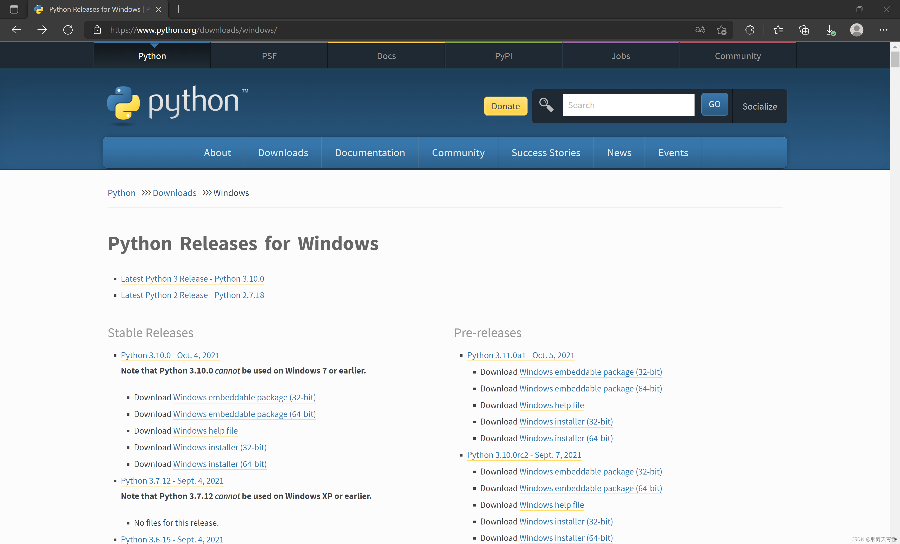
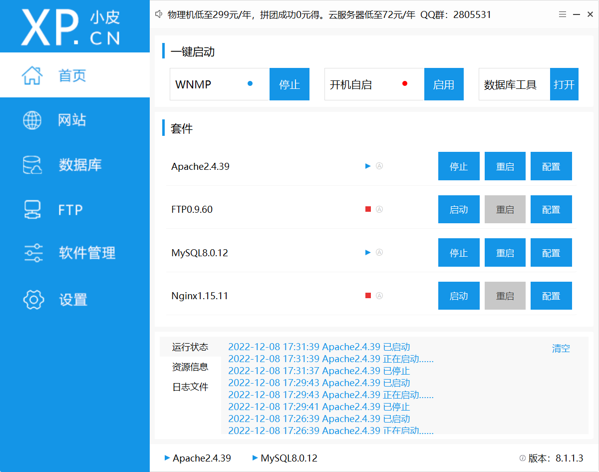
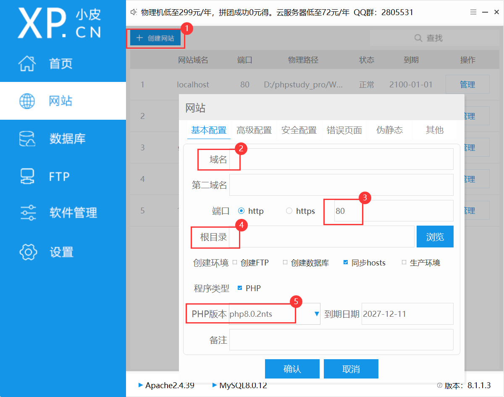
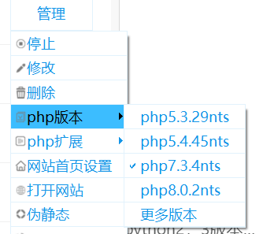
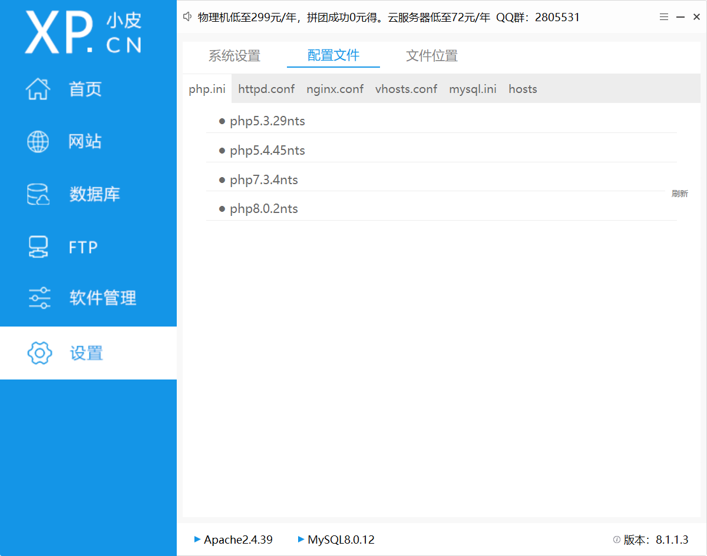

# 写在前面
本人刚入门时的基础比小白还小白，学习路上逛了不少博客
各个平台上的博客无非抄来抄去，我把我认为有用的内容整合了一下
大自然的搬运工罢了
## What is Web
**what is web的内容借鉴自Landasika师傅写的文章，有删改**
## 一、WEB安全是什么
web也就是俗称的web安全，也就是大家打开浏览器的那一刻。就开始和web打交道了。我们是学网络安全的，web安全是网络中最经典的应用之一。
Web安全就是要提供证据表明，在面对敌意和恶意输入的时候，web系统应用仍然能够充分地满足它的需求
2005年06月，CardSystems，黑客恶意侵入了它的电脑系统，窃取了4000万张信用卡的资料。
2011年12月，国内最大的开发者社区CSDN被黑客在互联网上公布了600万注册用户的数据；黑客随后陆续公布了网易、人人、天涯、猫扑等多家大型网站的数据信息。
## 二、如何入门WEB安全
可以参考这篇文章：[https://zhuanlan.zhihu.com/p/409570216](https://zhuanlan.zhihu.com/p/409570216)
常见Web安全漏洞大致可以分为：信息泄露、弱口令爆破、命令执行、文件包含、php特性、文件上传、sql注入、反序列化、代码审计、XSS、jwt、SSRF、CSRF
先深入理解这些漏洞背后的原理和知识，然后运用于实战化（CTF模拟）
推荐新手刷题平台：[ctf.show](https://ctf.show/)，[https://buuoj.cn/](https://buuoj.cn/)

**有些童鞋会问，从哪里开始呢？**
大家莫慌，先从一个搭建一个网页，理解运行机理开始吧！
**本地服务器的搭建：利用phpstudy搭建一个wamp**

- 参考链接：[https://blog.csdn.net/weixin_43837883/article/details/114021104](https://blog.csdn.net/weixin_43837883/article/details/114021104)

最终实现，其实并不需要你实现安装一个wordpress博客。在网页所在的根目录找到index.html即可。
之后可以学习一下web前端html的语言构造
以及了解js是什么（在学习XSS漏洞的时候了解即可）
然后学习一下php的语言
（不需要那么精通，只需要知道有什么出题的点，能看懂代码就好）
然后就可以开始学习一些漏洞，可以从最简单的php特性开始。
在本篇中，我把php的一些特性放在了前置知识的位置，大家可以随学随看
### 三、书籍推荐

- 学web入门推荐是《web安全深度剖析》虽然内容有些老，但是对新手入门很友好。
- 《web前端黑客技术揭秘》偏向于前端黑客知识，都是些理论话的东西
- 还有是徐焱的《web安全攻防》这本书偏向于web渗透实战，手把手教你如何搭建环境。还有配套的源代码，可以边搞实战技巧边玩代码审计。
- 再然后就是道哥的《白帽子讲web安全》了，萌新读这个可能会有点困难，但是这本书不可不读，里面的思想方法值得学习。
- 中后期就是偏向于编程和脚本了，搞web首先就是要学好PHP，然后可以学python（CTF题目很多是要写脚本的）学好编程并能写一些简单的工具是web渗透的分水岭
### 方便我们使用的软件

- notepad++（力荐）
- Sublime text（多系统兼容
- utools
- Typora
## 前置知识
不是看完前置知识才能学习漏洞，这里仅作整理，边看边学
这份大纲会带你过一遍学习web所需的一些主要的基础知识，但是难免有疏漏的地方，大家学习的时候遇到不明白的问题多多百度，百度解决不了的随时问学长学姐，周报求质不求量，学到东西才是最重要的
补充：已经从“百度时代”进入“ai时代”了，ai可以解决大多数的问题
## 1.http状态码
```python
 1开头的http状态码
表示临时响应并需要请求者继续执行操作的状态代码。

100   （继续） 请求者应当继续提出请求。 服务器返回此代码表示已收到请求的第一部分，正在等待其余部分。  
101   （切换协议） 请求者已要求服务器切换协议，服务器已确认并准备切换。
—————————————————————————————————————————————————————————————————————————————————————————
2开头的http状态码
表示请求成功

200     成功处理了请求，一般情况下都是返回此状态码； 
201     请求成功并且服务器创建了新的资源。 
202     接受请求但没创建资源； 
203     返回另一资源的请求； 
204     服务器成功处理了请求，但没有返回任何内容；
205     服务器成功处理了请求，但没有返回任何内容；
206     处理部分请求；
—————————————————————————————————————————————————————————————————————————————————————————
3xx （重定向） 
重定向代码，也是常见的代码

300   （多种选择）  针对请求，服务器可执行多种操作。 服务器可根据请求者 (user agent) 选择一项操作，或提供操作列表供请求者选择。 
301   （永久移动）  请求的网页已永久移动到新位置。 服务器返回此响应（对 GET 或 HEAD 请求的响应）时，会自动将请求者转到新位置。 
302   （临时移动）  服务器目前从不同位置的网页响应请求，但请求者应继续使用原有位置来进行以后的请求。 
303   （查看其他位置） 请求者应当对不同的位置使用单独的 GET 请求来检索响应时，服务器返回此代码。 
304   （未修改） 自从上次请求后，请求的网页未修改过。 服务器返回此响应时，不会返回网页内容。 
305   （使用代理） 请求者只能使用代理访问请求的网页。 如果服务器返回此响应，还表示请求者应使用代理。 
307   （临时重定向）  服务器目前从不同位置的网页响应请求，但请求者应继续使用原有位置来进行以后的请求。
—————————————————————————————————————————————————————————————————————————————————————————
4开头的http状态码表示请求出错

400    服务器不理解请求的语法。 
401   请求要求身份验证。 对于需要登录的网页，服务器可能返回此响应。 
403   服务器拒绝请求。 
404   服务器找不到请求的网页。 
405   禁用请求中指定的方法。 
406   无法使用请求的内容特性响应请求的网页。 
407   此状态代码与 401类似，但指定请求者应当授权使用代理。 
408   服务器等候请求时发生超时。 
409   服务器在完成请求时发生冲突。 服务器必须在响应中包含有关冲突的信息。 
410   如果请求的资源已永久删除，服务器就会返回此响应。 
411   服务器不接受不含有效内容长度标头字段的请求。 
412   服务器未满足请求者在请求中设置的其中一个前提条件。 
413   服务器无法处理请求，因为请求实体过大，超出服务器的处理能力。 
414   请求的 URI（通常为网址）过长，服务器无法处理。 
415   请求的格式不受请求页面的支持。 
416   如果页面无法提供请求的范围，则服务器会返回此状态代码。 
417   服务器未满足”期望”请求标头字段的要求。
—————————————————————————————————————————————————————————————————————————————————————————
5开头状态码并不常见，但是我们应该知道

500   （服务器内部错误）  服务器遇到错误，无法完成请求。 
501   （尚未实施） 服务器不具备完成请求的功能。 例如，服务器无法识别请求方法时可能会返回此代码。 
502   （错误网关） 服务器作为网关或代理，从上游服务器收到无效响应。 
503   （服务不可用） 服务器目前无法使用（由于超载或停机维护）。 通常，这只是暂时状态。 
504   （网关超时）  服务器作为网关或代理，但是没有及时从上游服务器收到请求。 
505   （HTTP 版本不受支持） 服务器不支持请求中所用的 HTTP 协议版本。  
```
## 2.正则表达式
[https://ihateregex.io/](https://ihateregex.io/)
[https://tool.oschina.net/regex](https://tool.oschina.net/regex)
### 表达式全集
**内容较长，展开查看**
??? "点击展开/收起"
    | 字符 | 描述 |
    | --- | --- |
    | \\ | 将下一个字符标记为一个特殊字符、或一个原义字符、或一个向后引用、或一个八进制转义符。例如，“n”匹配字符“n”而“\\n”匹配一个换行符。串行“\\\\”匹配“\\”而“\\(”则匹配“(”。 |
    | ^ | 匹配输入字符串的开始位置。如果设置了RegExp对象的Multiline属性，^也匹配“\\n”或“\\r”之后的位置。 |
    | $ | 匹配输入字符串的结束位置。如果设置了RegExp对象的Multiline属性，$也匹配“\\n”或“\\r”之前的位置。 |
    | * | 匹配前面的子表达式零次或多次。例如，zo*能匹配“z”以及“zoo”。*等价于{0,}。 |
    | + | 匹配前面的子表达式一次或多次。例如，“zo+”能匹配“zo”以及“zoo”，但不能匹配“z”。+等价于{1,}。 |
    | ? | 匹配前面的子表达式零次或一次。例如，“do(es)?”可以匹配“does”或“does”中的“do”。?等价于{0,1}。 |
    | {_n_} | _n_是一个非负整数。匹配确定的_n_次。例如，“o{2}”不能匹配“Bob”中的“o”，但是能匹配“food”中的两个o。 |
    | {_n_,} | _n_是一个非负整数。至少匹配_n_次。例如，“o{2,}”不能匹配“Bob”中的“o”，但能匹配“foooood”中的所有o。“o{1,}”等价于“o+”。“o{0,}”则等价于“o*”。 |
    | {_n_,_m_} | _m_和_n_均为非负整数，其中_n_<=_m_。最少匹配_n_次且最多匹配_m_次。例如，“o{1,3}”将匹配“fooooood”中的前三个o。“o{0,1}”等价于“o?”。请注意在逗号和两个数之间不能有空格。 |
    | ? | 当该字符紧跟在任何一个其他限制符（*,+,?，{_n_}，{_n_,}，{_n_,_m_}）后面时，匹配模式是非贪婪的。非贪婪模式尽可能少的匹配所搜索的字符串，而默认的贪婪模式则尽可能多的匹配所搜索的字符串。例如，对于字符串“oooo”，“o+?”将匹配单个“o”，而“o+”将匹配所有“o”。 |
    | . | 匹配除“\\_n_”之外的任何单个字符。要匹配包括“\\_n_”在内的任何字符，请使用像“(.&#124;\\n)”的模式。 |
    | (pattern) | 匹配pattern并获取这一匹配。所获取的匹配可以从产生的Matches集合得到，在VBScript中使用SubMatches集合，在JScript中则使用$0…$9属性。要匹配圆括号字符，请使用“\\(”或“\\)”。 |
    | (?:pattern) | 匹配pattern但不获取匹配结果，也就是说这是一个非获取匹配，不进行存储供以后使用。这在使用或字符“(&#124;)”来组合一个模式的各个部分是很有用。例如“industr(?:y&#124;ies)”就是一个比“industry&#124;industries”更简略的表达式。 |
    | (?=pattern) | 正向肯定预查，在任何匹配pattern的字符串开始处匹配查找字符串。这是一个非获取匹配，也就是说，该匹配不需要获取供以后使用。例如，“Windows(?=95&#124;98&#124;NT&#124;2000)”能匹配“Windows2000”中的“Windows”，但不能匹配“Windows3.1”中的“Windows”。预查不消耗字符，也就是说，在一个匹配发生后，在最后一次匹配之后立即开始下一次匹配的搜索，而不是从包含预查的字符之后开始。 |
    | (?!pattern) | 正向否定预查，在任何不匹配pattern的字符串开始处匹配查找字符串。这是一个非获取匹配，也就是说，该匹配不需要获取供以后使用。例如“Windows(?!95&#124;98&#124;NT&#124;2000)”能匹配“Windows3.1”中的“Windows”，但不能匹配“Windows2000”中的“Windows”。预查不消耗字符，也就是说，在一个匹配发生后，在最后一次匹配之后立即开始下一次匹配的搜索，而不是从包含预查的字符之后开始 |
    | (?<=pattern) | 反向肯定预查，与正向肯定预查类拟，只是方向相反。例如，“(?<=95&#124;98&#124;NT&#124;2000)Windows”能匹配“2000Windows”中的“Windows”，但不能匹配“3.1Windows”中的“Windows”。 |
    | (?<!pattern) | 反向否定预查，与正向否定预查类拟，只是方向相反。例如“(?<!95&#124;98&#124;NT&#124;2000)Windows”能匹配“3.1Windows”中的“Windows”，但不能匹配“2000Windows”中的“Windows”。 |
    | x&#124;y | 匹配x或y。例如，“z&#124;food”能匹配“z”或“food”。“(z&#124;f)ood”则匹配“zood”或“food”。 |
    | [xyz] | 字符集合。匹配所包含的任意一个字符。例如，“[abc]”可以匹配“plain”中的“a”。 |
    | [^xyz] | 负值字符集合。匹配未包含的任意字符。例如，“[^abc]”可以匹配“plain”中的“p”。 |
    | [a-z] | 字符范围。匹配指定范围内的任意字符。例如，“[a-z]”可以匹配“a”到“z”范围内的任意小写字母字符。 |
    | [^a-z] | 负值字符范围。匹配任何不在指定范围内的任意字符。例如，“[^a-z]”可以匹配任何不在“a”到“z”范围内的任意字符。 |
    | \\b | 匹配一个单词边界，也就是指单词和空格间的位置。例如，“er\\b”可以匹配“never”中的“er”，但不能匹配“verb”中的“er”。 |
    | \\B | 匹配非单词边界。“er\\B”能匹配“verb”中的“er”，但不能匹配“never”中的“er”。 |
    | \\cx | 匹配由x指明的控制字符。例如，\\cM匹配一个Control-M或回车符。x的值必须为A-Z或a-z之一。否则，将c视为一个原义的“c”字符。 |
    | \\d | 匹配一个数字字符。等价于[0-9]。 |
    | \\D | 匹配一个非数字字符。等价于[^0-9]。 |
    | \\f | 匹配一个换页符。等价于\\x0c和\\cL。 |
    | \\n | 匹配一个换行符。等价于\\x0a和\\cJ。 |
    | \\r | 匹配一个回车符。等价于\\x0d和\\cM。 |
    | \\s | 匹配任何空白字符，包括空格、制表符、换页符等等。等价于[ \\f\\n\\r\\t\\v]。 |
    | \\S | 匹配任何非空白字符。等价于[^ \\f\\n\\r\\t\\v]。 |
    | \\t | 匹配一个制表符。等价于\\x09和\\cI。 |
    | \\v | 匹配一个垂直制表符。等价于\\x0b和\\cK。 |
    | \\w | 匹配包括下划线的任何单词字符。等价于“[A-Za-z0-9_]”。 |
    | \\W | 匹配任何非单词字符。等价于“[^A-Za-z0-9_]”。 |
    | \\x_n_ | 匹配_n_，其中_n_为十六进制转义值。十六进制转义值必须为确定的两个数字长。例如，“\\x41”匹配“A”。“\\x041”则等价于“\\x04&1”。正则表达式中可以使用ASCII编码。. |
    | \\_num_ | 匹配_num_，其中_num_是一个正整数。对所获取的匹配的引用。例如，“(.)\\1”匹配两个连续的相同字符。 |
    | \\_n_ | 标识一个八进制转义值或一个向后引用。如果\\_n_之前至少_n_个获取的子表达式，则_n_为向后引用。否则，如果_n_为八进制数字（0-7），则_n_为一个八进制转义值。 |
    | \\_nm_ | 标识一个八进制转义值或一个向后引用。如果\\_nm_之前至少有_nm_个获得子表达式，则_nm_为向后引用。如果\\_nm_之前至少有_n_个获取，则_n_为一个后跟文字_m_的向后引用。如果前面的条件都不满足，若_n_和_m_均为八进制数字（0-7），则\\_nm_将匹配八进制转义值_nm_。 |
    | \\_nml_ | 如果_n_为八进制数字（0-3），且_m和l_均为八进制数字（0-7），则匹配八进制转义值_nm_l。 |
    | \\u_n_ | 匹配_n_，其中_n_是一个用四个十六进制数字表示的Unicode字符。例如，\\u00A9匹配版权符号（©）。 |

### 常用正则表达式
| 用户名 | /^[a-z0-9_-]{3,16}$/ |
| --- | --- |
| 密码 | /^[a-z0-9_-]{6,18}$/ |
| 十六进制值 | /^#?([a-f0-9]{6}&#124;[a-f0-9]{3})$/ |
| 电子邮箱 | /^([a-z0-9_\\.-]+)@([\\da-z\\.-]+)\\.([a-z\\.]{2,6})$/
`/^[a-z\\d]+(\\.[a-z\\d]+)*@([\\da-z](-[\\da-z])?)+(\\.{1,2}[a-z]+)+$/` |
| URL | /^(https?:\\/\\/)?([\\da-z\\.-]+)\\.([a-z\\.]{2,6})([\\/\\w \\.-]*)*\\/?$/ |
| IP 地址 | /((2[0-4]\\d&#124;25[0-5]&#124;[01]?\\d\\d?)\\.){3}(2[0-4]\\d&#124;25[0-5]&#124;[01]?\\d\\d?)/
/^(?:(?:25[0-5]&#124;2[0-4][0-9]&#124;[01]?[0-9][0-9]?)\\.){3}(?:25[0-5]&#124;2[0-4][0-9]&#124;[01]?[0-9][0-9]?)$/ |
| HTML 标签 | /^<([a-z]+)([^<]+)*(?:>(.*)<\\/\\1>&#124;\\s+\\/>)$/ |
| 删除代码\\\\注释 | (?<!http:&#124;\\S)//.*$ |
| Unicode编码中的汉字范围 | /^[\\u2E80-\\u9FFF]+$/ |

## 3.常见的HTTP头部信息
Accept: 允许哪些媒体类型
Accept-Charset: 允许哪些字符集
Accept-Encoding: 允许哪些编码
Accept-Language: 允许哪些语言
Cache-Control: 缓存策略，如no-cache，详见官方文档
Connection: 连接选项，例如是否允许代理。
Host: 请求的主机
If-None-Match: 判断请求实体的Etag是否包含在If-None-Match中，如果包含，则返回304，使用缓存，见Etag
If-Modified-Since: 判断修改时间是否一致，如果一致，则使用缓存
If-Match: 与If-None-Match相反
If-Unmodified-Since: 与If-Modified-Since相反
Referer: 表明这个请求发起的源头
User-Agent: 这个大家相信应该很熟悉了，就是经常用来做浏览器检测的userAgent。
Cache-Control: 缓存策略，如max-age:100，详见官方文档
Connection: 连接选项，例如是否允许代理
Content-Encoding: 返回内容的编码，如gzip
Content-Language: 返回内容的语言
Content-Length: 返回内容的字节长度
Content-Type: 返回内容的媒体类型，如text/html
Data: 返回时间
Etag: entity tag，实体标签，给每个实体生成一个单独的值，用于客户端缓存，与If-None-Match配合使用
Expires: 设置缓存过期时间，Cache-Control也会相应变化
Last-Modified: 最近修改时间，用于客户端缓存，与If-Modified-Since配合使用
Pragma: 似乎和Cache-Control差不多，用于旧的浏览器
Server: 服务器信息。
Vary: WEB服务器用该头部的内容告诉 Cache 服务器，在什么条件下才能用本响应所返回的对象响应后续的请求。假如源WEB服务器在接到第一个请求消息时，其响应消息的头部为：Content-Encoding: gzip; Vary: Content-Encoding那么 Cache 服务器会分析后续请求消息的头部，检查其 Accept-Encoding，是否跟先前响应的 Vary 头部值一致，即是否使用相同的内容编码方法，这样就可以防止 Cache 服务器用自己 Cache 里面压缩后的实体响应给不具备解压能力的浏览器
## 4.url编码集
**内容较长，展开查看**

??? "点击展开/收起"
        
    | ASCII 字符 | URL-编码 |
    | --- | --- |
    | space | %20 |
    | ! | %21 |
    | " | %22 |
    | # | %23 |
    | $ | %24 |
    | % | %25 |
    | & | %26 |
    | ' | %27 |
    | ( | %28 |
    | ) | %29 |
    | * | %2A |
    | + | %2B |
    | , | %2C |
    | - | %2D |
    | . | %2E |
    | / | %2F |
    | 0 | %30 |
    | 1 | %31 |
    | 2 | %32 |
    | 3 | %33 |
    | 4 | %34 |
    | 5 | %35 |
    | 6 | %36 |
    | 7 | %37 |
    | 8 | %38 |
    | 9 | %39 |
    | : | %3A |
    | ; | %3B |
    | < | %3C |
    | = | %3D |
    | > | %3E |
    | ? | %3F |
    | @ | %40 |
    | A | %41 |
    | B | %42 |
    | C | %43 |
    | D | %44 |
    | E | %45 |
    | F | %46 |
    | G | %47 |
    | H | %48 |
    | I | %49 |
    | J | %4A |
    | K | %4B |
    | L | %4C |
    | M | %4D |
    | N | %4E |
    | O | %4F |
    | P | %50 |
    | Q | %51 |
    | R | %52 |
    | S | %53 |
    | T | %54 |
    | U | %55 |
    | V | %56 |
    | W | %57 |
    | X | %58 |
    | Y | %59 |
    | Z | %5A |
    | [ | %5B |
    | \\ | %5C |
    | ] | %5D |
    | ^ | %5E |
    | _ | %5F |
    | ` | %60 |
    | a | %61 |
    | b | %62 |
    | c | %63 |
    | d | %64 |
    | e | %65 |
    | f | %66 |
    | g | %67 |
    | h | %68 |
    | i | %69 |
    | j | %6A |
    | k | %6B |
    | l | %6C |
    | m | %6D |
    | n | %6E |
    | o | %6F |
    | p | %70 |
    | q | %71 |
    | r | %72 |
    | s | %73 |
    | t | %74 |
    | u | %75 |
    | v | %76 |
    | w | %77 |
    | x | %78 |
    | y | %79 |
    | z | %7A |
    | { | %7B |
    | &#124; | %7C |
    | } | %7D |
    | ~ | %7E |
    |   | %7F |
    | ` | %80 |
    |  | %81 |
    | ‚ | %82 |
    | ƒ | %83 |
    | „ | %84 |
    | … | %85 |
    | † | %86 |
    | ‡ | %87 |
    | ˆ | %88 |
    | ‰ | %89 |
    | Š | %8A |
    | ‹ | %8B |
    | Π| %8C |
    |  | %8D |
    | Ž | %8E |
    |  | %8F |
    |  | %90 |
    | ' | %91 |
    | ' | %92 |
    | " | %93 |
    | " | %94 |
    | • | %95 |
    | – | %96 |
    | — | %97 |
    | ˜ | %98 |
    | ™ | %99 |
    | š | %9A |
    | › | %9B |
    | œ | %9C |
    |  | %9D |
    | ž | %9E |
    | Ÿ | %9F |
    |   | %A0 |
    | ¡ | %A1 |
    | ¢ | %A2 |
    | £ | %A3 |
    | ¤ | %A4 |
    | ¥ | %A5 |
    | ¦ | %A6 |
    | § | %A7 |
    | ¨ | %A8 |
    | © | %A9 |
    | ª | %AA |
    | « | %AB |
    | ¬ | %AC |
    |   | %AD |
    | ® | %AE |
    | ¯ | %AF |
    | ° | %B0 |
    | ± | %B1 |
    | ² | %B2 |
    | ³ | %B3 |
    | ´ | %B4 |
    | µ | %B5 |
    | ¶ | %B6 |
    | · | %B7 |
    | ¸ | %B8 |
    | ¹ | %B9 |
    | º | %BA |
    | » | %BB |
    | ¼ | %BC |
    | ½ | %BD |
    | ¾ | %BE |
    | ¿ | %BF |
    | À | %C0 |
    | Á | %C1 |
    | Â | %C2 |
    | Ã | %C3 |
    | Ä | %C4 |
    | Å | %C5 |
    | Æ | %C6 |
    | Ç | %C7 |
    | È | %C8 |
    | É | %C9 |
    | Ê | %CA |
    | Ë | %CB |
    | Ì | %CC |
    | Í | %CD |
    | Î | %CE |
    | Ï | %CF |
    | Ð | %D0 |
    | Ñ | %D1 |
    | Ò | %D2 |
    | Ó | %D3 |
    | Ô | %D4 |
    | Õ | %D5 |
    | Ö | %D6 |
    | × | %D7 |
    | Ø | %D8 |
    | Ù | %D9 |
    | Ú | %DA |
    | Û | %DB |
    | Ü | %DC |
    | Ý | %DD |
    | Þ | %DE |
    | ß | %DF |
    | à | %E0 |
    | á | %E1 |
    | â | %E2 |
    | ã | %E3 |
    | ä | %E4 |
    | å | %E5 |
    | æ | %E6 |
    | ç | %E7 |
    | è | %E8 |
    | é | %E9 |
    | ê | %EA |
    | ë | %EB |
    | ì | %EC |
    | í | %ED |
    | î | %EE |
    | ï | %EF |
    | ð | %F0 |
    | ñ | %F1 |
    | ò | %F2 |
    | ó | %F3 |
    | ô | %F4 |
    | õ | %F5 |
    | ö | %F6 |
    | ÷ | %F7 |
    | ø | %F8 |
    | ù | %F9 |
    | ú | %FA |
    | û | %FB |
    | ü | %FC |
    | ý | %FD |
    | þ | %FE |
    | ÿ | %FF |

## 5.windows系统python2，3版本共存问题
编写python脚本是后期各方向解题的重要手段（如sql注入漏洞利用方式中的盲注极其耗费时间精力，纯人力几乎无法完成）但是部分工具对python有版本限制，或python2，3版本会得到不同结果（如在flask框架的SSTI漏洞中python2与python3内置的索引值不同）
目前，Python3和Python2互相并不完全兼容，这就造成了很多Python代码或者是脚本在版本不对应的情况下无法执行，所以说，在一台电脑上同时拥有Python2和Python3是很有必要的，也能更高效的处理工作，节省时间。
其实要解决Python2和Python3共存也很简单，提供如下方案：
### 1、下载Python2和Python3的安装包(或者叫解释器)
下载地址：[https://www.python.org/downloads/windows/](https://www.python.org/downloads/windows/)
根据自己需要的版本下载即可，安装包都比较小。

下载后，直接安装即可。
安装过程注意安装路径，默认是安装到C盘，可以根据需要进行更改安装路径。

### 2、设置环境变量
由于我们安装了两个版本的Python，因此为了方便系统能够准确识别到指定的Python版本，所以我们需要设置环境变量。
将Python安装路径及其安装路径下的Scripts设置到Path变量里。
这里设置Scripts文件夹的目的是为了方便识别pip。
 
### 3、修改Python编译器的名字
为了能够准确定位Python2和Python3，我们需要将默认的Python编辑器的名称进行修改。
**NO.1. **修改Python2安装目录下：python.exe修改为python2.exe，pythonw.exe修改为pythonw2.exe
**NO.2. **修改Python3安装目录下：python.exe修改为python3.exe，pythonw.exe修改为pythonw3.exe
修改完成后，在cmd命令行下分别输入python2和python3就可以进入对应版本的python环境。
### 4、设置pip
python环境在安装包的时候需要使用到包管理工具——pip，而pip也是需要对应版本的。在python的安装目录Scripts下可以看到 默认是存在pip的，但是在命令行下，并不能直接定位到，因此需要重新分别安装两个版本对应的pip，使得两个python版本的pip也能够共存。
#### python2：
`python2 -m pip install --upgrade pip`
#### python3:
`python3 -m pip install --upgrade pip`
安装完成之后，可以使用pip2 -V 或者pip3 -V查看对应的pip版本了。
## 6.关于靶场环境搭建
web的十大漏洞当中有很多漏洞在github上都能找到大师傅制作出来供学习用的靶场，这里针对一些可能出现的问题供大家参考
首先大家需要了解LAMP和LNMP，也就是linux，apache/nginx，mysql，php
这里Linux环境的实现需要用到虚拟机，也就是VMware，大家使用社团给的kali镜像，自行百度一下安装教程配置即可

mysql是数据库的一种，对于专业开发人员可以使用navicat去管理数据库，这里仅作了解，对于环境搭建，使用PHPstudy即可满足我们全部的需求
phpstudy集成了php，mysql和apache、nginx两个web中间件（不知道什么是中间件的自己去百度），需要使用时按需求随时启停即可

那么如何搭建一个新环境呢

phpstudy的目录下默认有一个WWW目录，下有一个localhost，即本地网站
想要创建新网站，遵照图中的几个步骤即可
域名设置起来除了不要有中文和符号之外非常自由，其实质就是在根目录下创建一个可以访问目录下资源的文件夹，这一点很好理解
端口设置为默认即可，若想改变端口，记得避开其他服务占用的端口，phpstudy提供了端口检测的功能，能够方便地测试和查看端口是否被占用，避免冲突

根目录可以自定义，默认会设定为软件安装路径的WWW目录下，比如我这里的目录是D:/phpstudy_pro/WWW/，设在E盘F盘也都是可以的（就是别放C盘）
建议不同漏洞的靶场
至于php版本问题，是一个非常值得说的点，这里暂不展开说，在后面的漏洞学习当中还会分别提到，在网站使用过程中，也可以对版本进行修改

除了php版本，其他软件的版本管理可以在下面找到

需要注意的是，无论更改了哪一项服务的版本，都需要重新启动才能生效
一些情况下还需要修改php的配置文件，每个版本对应一个ini文件，用txt打开即可

